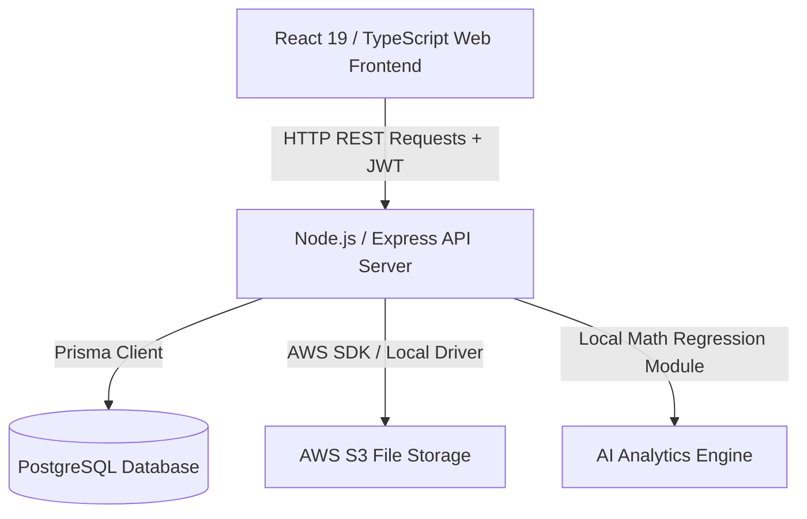
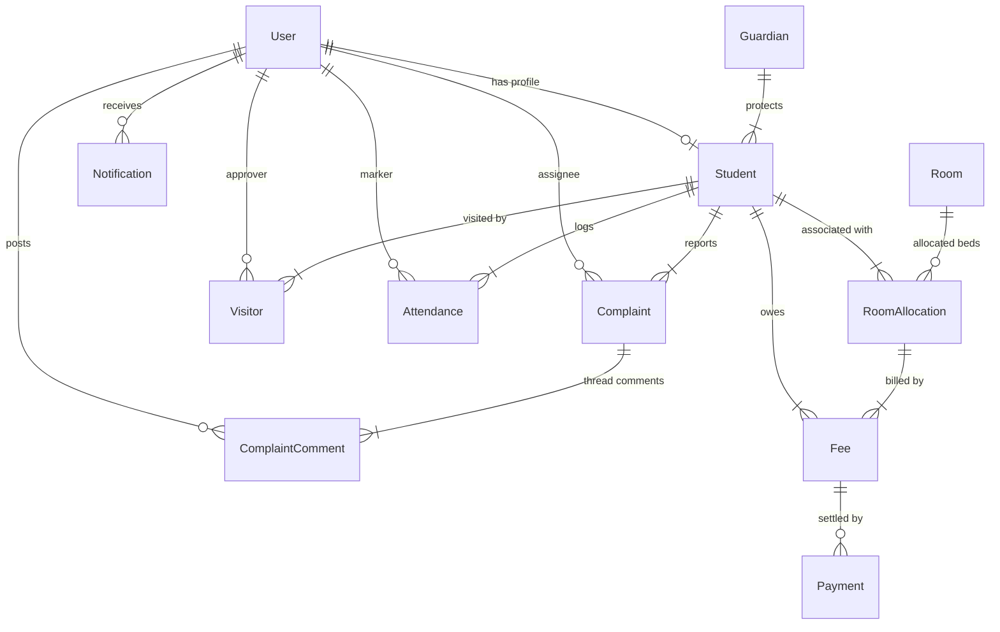

# Aegis Hostel | AI-Powered Hostel Management Platform

Aegis is a complete, production-ready, fully integrated Hostel Management Platform. It features a modern React 19 web frontend with slate theme designs and dynamic dashboard widgets, backed by a Node.js/Express REST API. It uses Prisma ORM to interact with a PostgreSQL database and includes local mathematical forecasting models for predictive operations.

---

## System Architecture



---

## Entity Relationship (ER) Diagram



---

## Folder Structure

```
hostel_management/
├── docker-compose.yml
├── README.md
├── backend/
│   ├── src/
│   │   ├── controllers/      # Route logic handlers
│   │   ├── middleware/       # JWT auth & RBAC guards
│   │   ├── routes/           # API router trees
│   │   ├── services/         # PDF receipt & AI forecast services
│   │   ├── utils/            # Prisma client singletons
│   │   ├── index.ts          # Core Express startup
│   │   └── types.ts          # Request context definitions
│   ├── prisma/
│   │   ├── schema.prisma     # Postgres schema
│   │   └── seed.ts           # Seeder (100 students, 50 rooms, logs)
│   ├── tests/                # Jest mock test suite
│   ├── package.json
│   ├── tsconfig.json
│   └── Dockerfile
└── frontend/
    ├── src/
    │   ├── components/       # Layouts, Sidebar, Header
    │   ├── services/         # Axios api client interceptors
    │   ├── pages/            # Login, Registration, Forms
    │   │   ├── dashboards/   # SuperAdmin, Manager, Warden, Student panels
    │   │   └── ...           # CRUD & Analytics views
    │   ├── App.tsx
    │   ├── index.css         # Styling system & dark mode variables
    │   └── main.tsx
    ├── package.json
    ├── tailwind.config.js
    ├── tsconfig.json
    └── Dockerfile
```

---

## Step-by-Step Installation Guides

### Option 1: Run and Orchestrate with Docker Compose (Recommended)

1. Make sure you have **Docker** and **Docker Compose** installed.
2. In the project root directory, spin up all containers (Database, Express API, and Nginx serving React):
   ```bash
   docker-compose up --build
   ```
3. Once running, access the services:
   - **Frontend App**: [http://localhost](http://localhost) (mapped on port 80)
   - **Backend API Server**: [http://localhost:5000](http://localhost:5000)
4. *Optional*: Seed database records inside Docker container environment:
   ```bash
   docker-compose exec backend npm run prisma:migrate
   docker-compose exec backend npm run prisma:seed
   ```

### Option 2: Local Manual Development Setup

#### Backend Setup:
1. Navigate to the `backend/` directory:
   ```bash
   cd backend
   ```
2. Setup database credentials inside a `.env` file (refer to `.env.example` template).
3. Install dependencies and build client bindings:
   ```bash
   npm install
   npx prisma generate
   ```
4. Run migrations and populate the database seed data (100 students, 50 rooms, 10 staff users, transactions, logs):
   ```bash
   npx prisma migrate dev --name init
   npm run prisma:seed
   ```
5. Spin up the API hot-reload developer server:
   ```bash
   npm run dev
   ```

#### Frontend Setup:
1. Navigate to the `frontend/` directory:
   ```bash
   cd ../frontend
   ```
2. Install packages:
   ```bash
   npm install
   ```
3. Start the Vite hot-module-replacement server:
   ```bash
   npm run dev
   ```
4. Open your browser at [http://localhost:3000](http://localhost:3000).

---

## Run Test Suite

To run the unit test assertions on the backend API routers and mathematical AI forecasting models:
```bash
cd backend
npm run test
```

---

## AWS Production Deployment Guide

### 1. Database Provisioning (AWS RDS PostgreSQL)
- Create a PostgreSQL database instance using **Amazon RDS** (Free Tier or DB subclass micro).
- Configure Security Groups to allow inbound access on port `5432` from the EC2 instance group.
- Export connection endpoint URI to configure backend `DATABASE_URL`.

### 2. S3 Media Storage
- Provision an **S3 Bucket** to host uploaded visitor pass photos or complaint snapshots.
- Setup an IAM user policy with write permissions (`s3:PutObject`, `s3:GetObject`) and save Access Keys.
- Set `USE_S3=true` in backend variables.

### 3. Server Deployment (AWS EC2 / ECS)
- Provision an **EC2 Instance** (Ubuntu 22.04 LTS micro/small).
- Configure Security Groups to allow TCP ingress on port `80` (HTTP), `443` (HTTPS), and `22` (SSH).
- Clone the repository, setup Docker Compose, configure `.env` variables, and run `docker-compose up -d`.
- Setup a reverse-proxy using Nginx on port 80/443 pointing to container slots. Apply SSL certificate using **Certbot/Let's Encrypt** for encrypted transactions.
